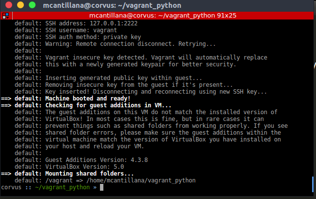
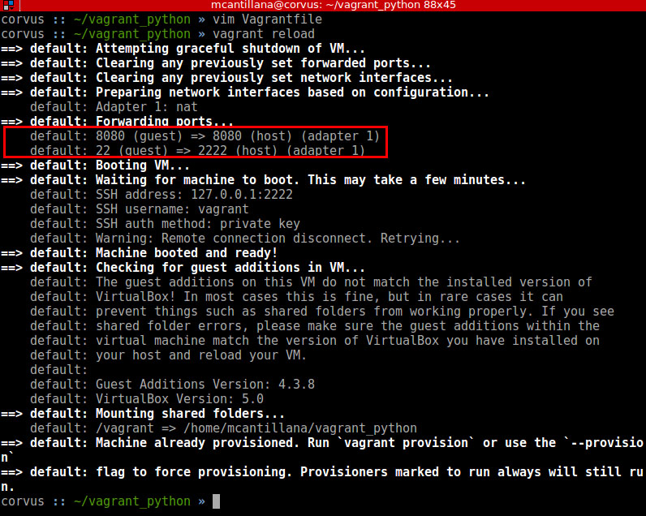
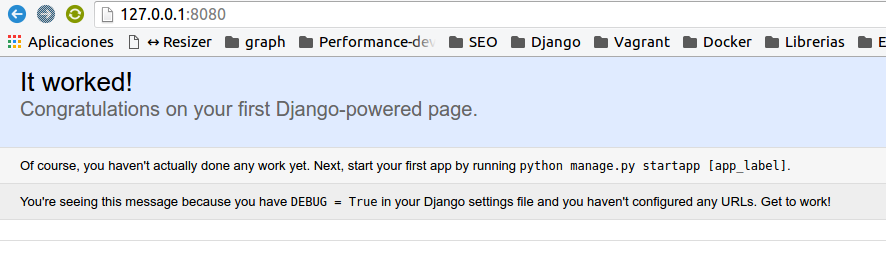

# Guía de instalación de Django & Vagrant

## Objetivos
El objetivo de la siguiente guía es entregar un listado de pasos que guían al usuario o alumno a instalar el ambiente de desarrollo para proyectos basados en pytho/django bajo un ambiente unificado utilizando Vagrant.

## Instalación
Como primera parte debemos tener instalado [Virtualbox](http://www.virtualbox.org) y [Vagrant](http://www.vagrantup.com) que los puedes descargar de sus respectivos sitios oficiales.

Una vez instalado Virtualbox y Vagrant procedemos a realizar los siguientes pasos.

***Nota: Este tutorial está escrito en ubuntu 16.04 pero debería funcionar sin problemas en windows. pero debes tener instalado el paquete de git-bash. Por lo que cuando se menciona abrir una terminal, para el caso de windows hace referencia a git bash***

### Instalando ambiente
Desde la terminal debes escribir 
```sh
mkdir vagrant_unab
```
Luego accedes al directorio creado con
```sh
cd vagrant_unab 
```

Desde el directorio debemos bajar nuestro box que nos permitirá montar nuestro ambiente Django y Python sobre nuestra maquina.
Para ello descargaremos el box utilizando el programa *wget* ejecutando la siguiente instrucción

```sh
wget http://phoenix.ewok.cl/vagrant_boxes/vagrant_unab.box
```
Con esto descargamos nuestro box por lo que ahora procedemos a su instalación.

Como estamos parados en el directorio *~/vagrant_unab* solo basta con ejecutar los siguientes pasos:
```sh
vagrant box add vagrant_unab vagrant_unab.box
```

Este comando instalará el box en nuestro sistema. tomará un poco de tiempo. También lo podríamos haber ejecutado directo desde internet a través del comando 
```sh
vagrant box add vagrant_unab http://phoenix.ewok.cl/vagrant_boxes/vagrant_unab.box
```

Pero prefiero verlo como procesos separados en esta primera entrega.

Luego de cargar el ambiente es necesario, inicializar nuestro ambiente vagrant. Para ello ejecutamos la siguiente instrucción:

```sh
vagrant init vagrant_unab
```

Esto generará un archivo de configuración llamado  `Vagrantfile` que luego editaremos para configurar nuestro ambiente.

Para probar si funciona el ambiente basta con ejecutar

```sh
 vagrant up
```
 
si les aparece algo similar a esta pantalla estaríamos okey con la instalación del ambiente
 
 

### Configurando Vagrant
El siguiente paso es configurar el forwarding de puertos para poder visualizar nuestro proyecto a través de la maquina local.

Para esto editamos el archivo *Vagrantfile* que se encuentra en la raiz de nuestro proyecto *~/vagrant_unab/Vagrantfile*

En este archivo debemos descomentar la siguiente línea. Es decirm buscar la línea

```sh
   # config.vm.network "forwarded_port", guest: 80, host: 8080
```

y dejarla así
```sh
 config.vm.network "forwarded_port", guest: 8080, host: 8080
```

Guardamos el archivo y debemos reiciar nuestro vagrant para que aplique los cambios. Para hacer este proceso basta con ejecutar
 
```sh
  vagrant reload
```

Si todo sale bien debería aparecer algo similar a la siguiente foto

 


Ahora debemos acceder al vagrant a través del comando vagrant ssh
 
```sh
  vagrant ssh
```
   
Con esto nos conectamos a la maquina linux de nuestro vagrant. Acá vamos a instalar nuestro primer proyecto de Django.

Para el proyecto de Django usaremos [virtualenv](http://rukbottoland.com/blog/tutorial-de-python-virtualenv/), utilidad que nos permite aislar nuestros ambientes de desarrollo con el objetivo de evitar problemas de versiones de bibliotecas, configuraciones, dependencias, etc. 

Para ello crearemos un ambiente con virtualenv ejecutando la siguiente instrucción

```sh
virtualenv demo_unab
```
Con esto nos creará un ambiente para nuestro proyecto. Luego accedemos a él usando 
```sh
cd demo_unab/
```

desde ese directorio debemos activar nuestro ambiente virtual, esto se hace ejecutando la siguiente instrucción:
```sh
source bin/activate
```
Esto activa el ambiente. nos daremos cuenta de esto por que se mostrará el nombre del ambiente al lado derecho del prompt entre parentesis. Ejemplo
```sh
(demo_unab)vagrant@precise32:~/demo_unab$ 
```

Ahora que tenemos el ambiente activo podemos instalar django y crear nuestra primera aplicación.


### Compartiendo directorios
Finalmente, necesitamos hacer una última configuración en nuestro vagrant que nos permitirá compartir directorios entre vagrant (donde tenemos instalado nuestro servidor) y nuestro equipo donde tenemos instalados nuestras herramientas de desarrollo, control de versiones, etc.

La idea es escribir en una carpeta de tu equipo como lo realizarías con otro proyecto y ejecutar el código a través del navegador que a su vez lo ejecutará nuestro vagrant.

Para configurar el __shared folder__ se debe editar el fichero *Vagrantfile* ubicado en la raiz de tu home (recuerda salir del vagrant si es que estas conectado, para ello puedes ejecutar el comando *exit*).

En Vagrantfile debes agregar la siguiente línea

```sh
config.vm.synced_folder "demo_django", "/home/vagrant/demo/src"
```

Donde demo_django es la carpeta de tu computador que quieres compartir, y debe estar al mismo nivel que el archivo *Vagrantfile*. El path */home/vagrant/demo/src*. Lo importante acá es que el path se compone del home del usuario vagrant */home/vagrant/* luego el nombre del proyecto que en nuestro caso es *demo* y finalmente el directorio src donde estará nuestro código.

Luego de esto debemos reiniciar la maquina, esto se hace con el siguiente comando

```sh
vagrant reload
```


### Instalando Django

Para la instalación de Django lo pimero que debemos hacer es instalar el paquete de django y esto se hace a través de:
```sh
 pip install django
```

Con ello instalamos la última versión disponible en el gestor de paquetes __pip__. Luego dentro de nuestro entorno virtual creremos nuestro directorio donde alojaremos  el código fuente de nuestra aplicación. La carpeta la llamaremos ___src___ que representa nuestro source code. Esto se realiza ejecutando el siguiente comando 

```sh
mkdir src 
```

Una vez creada la carpeta, accemos a ella con
```sh
cd src 
```

Desde la carpeta ejecutamos el siguiente comando de django
```sh
django-admin startproject demo .
```

Esto crea un proyecto Django en la carpeta ___src___. Luego de ello debemos inicializar el modelo de datos base que utilizará Django para el sistema de autenticación y administrador. Para ello ejecutamos el siguiente comando

```sh
python manage.py migrate
```

Con ello migramos el modelo base. Para probar que todo esté funcionando ejecutamos el siguiente comando

```sh
python manage.py runserver 0.0.0.0:8080
```

Este comando levanta el servidor de desarrollo en Django. Como estamos detrás de un vagrant debemos indicarle el puerto que hicimos el forward que en este caso es ___8080___ y además debemos indicarle que acepté cualquier IP para poder permitir la conexión fuera del vagrant.

Si todo funciona de forma correcta, deberían tener una salida similar a la siguiente

```sh
(demo_unab)vagrant@precise32:~/demo_unab/src$ python manage.py runserver 0.0.0.0:8080
Performing system checks...

System check identified no issues (0 silenced).
June 07, 2016 - 15:37:07
Django version 1.10a1, using settings 'demo.settings'
Starting development server at http://0.0.0.0:8080/
Quit the server with CONTROL-C.
```

Para probar solo debemos abrir un navegador web y escribir la url http://127.0.0.1:8080 y deberían ver algo similar al siguiente pantallazo



Con esto ya tenemos django instalado y ahora solo queda programar!!!