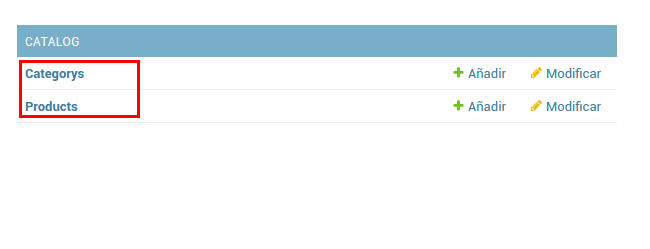

# Catálogo de productos (Simple)
En el siguiente documento se describen los pasos para realizar una aplicación con django todo esto bajo una instalación con vagrant. si no tienes claro como configurar tu equipo instalación con vagrant visita ésta [guía](https://github.com/mcantillana/unab_install_django).

## Creando nuestro proyecto
Asumiendo que tenemos creado nuestro entorno virtual y configurado nuestro ambiente de desarrollo(Este tutorial parte de la base que se dejó en está [guía](https://github.com/mcantillana/unab_install_django).), debemos crear nuestro proyecto de catálogo. Para esto ejecutamos lo siguiente


```sh
django-admin startproject ecommerce .
```

Con este comando creamos la estructura base del proyecto. 

```
├── ecommerce
│   ├── __init__.py
│   ├── settings.py
│   ├── urls.py
│   ├── wsgi.py
├── manage.py
├── db.sqlite3
```

Ahora debemos aplicar las migraciones que vienen por defecto para poder utilizar las funcionalidades del administrador. Para esto ejecutamos

```sh
python manage.py migrate
```

Con este proceso se ejecutaran las migraciones iniciales de nuestro proyecto. Luego necesitamos crear nuestro super usuario para el administrador. Esto lo realizaremos con:

```sh
python manage.py createsuperuser
```

Completamos con la información que nos solicita y este script creará un super usuario para nuestro sistema.

Luego podemos probar nuestra aplicación ejecutando

```sh
python manage.py runserver 0.0.0.0:8080
```

Si todo está correcto, desde el navegador podemos acceder a ___http://127.0.0.1:8080/admin___ y utilizar nuestro usuario y contraseña.

## Creando nuestra aplicación
El objetivo de nuestra aplicación es poder tener productos que pertenezcan a categorías. Algo simple; un producto puede pertenecer a una categoría y una categoría puede tener varios productos.

```
+---------------------+                 +----------------------+
|                     |                 |                      |
|                     |      1..n       |                      |
|      Categorías     +---------------->+      Productos       |
|                     |                 |                      |
|                     |                 |                      |
+---------------------+                 +----------------------+
```

Para esto vamos a crear nuestra app y como nombre utilizaremos **catalog**; esto lo hacemos ejecutando el siguiente comando.

```sh
python manage.py startapp catalog
```

Al ejecutar este comando nos crea un estructura similar a la siguiente

```
├── catalog
│   ├── admin.py
│   ├── apps.py
│   ├── __init__.py
│   ├── migrations
│   │   ├── __init__.py
│   ├── models.py
│   ├── tests.py
│   ├── urls.py
│   ├── views.py
├── db.sqlite3
├── ecommerce
│   ├── __init__.py
│   ├── settings.py
│   ├── urls.py
│   ├── wsgi.py
├── manage.py
```

Donde se crea catalog y un estructura que donde vamos a codificar nuestra aplicación.

Una vez creada la aplicación debemos indicarle a Django sobre la nueva app creada. Esto se hace editando el setting de nuestro proyecto. Este archivo está ubicado en el directorio ecommerce/settins.py. En este archivo buscamos la siguiente lista:

```python
INSTALLED_APPS = [
    'django.contrib.admin',
    'django.contrib.auth',
    'django.contrib.contenttypes',
    'django.contrib.sessions',
    'django.contrib.messages',
    'django.contrib.staticfiles',  
]
```

Al final de la lista, agregamos nuestra app y debería quedar así:
```python
INSTALLED_APPS = [
    'django.contrib.admin',
    'django.contrib.auth',
    'django.contrib.contenttypes',
    'django.contrib.sessions',
    'django.contrib.messages',
    'django.contrib.staticfiles',
    'catalog',
]
```


Luego de este proceso procederemos a programar nuestra aplicación: los pasos a seguir serían programar nuestro modelos, configurar la vistas en el administrador y programar nuestro HTML.

### Modelos en django
Una de las características de Django es que nuestro modelo de datos lo debemos escribir en python, asi como la relacion de las entidades. Django provee soporte para relacionar entidades del tipo ***uno es a uno***, ***uno es muchos***, ***muchos es a muchos***. si quieres saber todas las opciones lo puedes revisar en la [documentación oficla](https://docs.djangoproject.com/en/1.9/ref/models/relations/).

Para comenzar con nuestro proyecto, debemos programar nuestro modelo de datos. 
Esto se realiza desde la app que hemos creado (recordar que se llama catalog). Entonces debemos acceder a la carpeta catalog y editamos el fichero models.py. En este archivo debemos escribir algo similar a lo siguiente:

```python
from __future__ import unicode_literals

from django.db import models

class Category(models.Model):
    name = models.CharField(max_length=200)
    description = models.TextField(blank=True,null=True)
    banner = models.ImageField(upload_to='images/banner_categories',blank=True,null=True)
    sort_order = models.IntegerField(default=0)
    status = models.BooleanField()
    created_at = models.DateTimeField(auto_now_add=True)
    updated_at = models.DateTimeField(auto_now=True)

    def __str__(self):
        return self.name


class Product(models.Model):
    name = models.CharField(max_length=100)
    image = models.ImageField(upload_to='images/data',blank=True,null=True)
    description = models.TextField()
    sku = models.CharField(max_length=100,unique=True)
    price = models.DecimalField(max_digits=11, decimal_places=2)
    category = models.ForeignKey(Category)
    status = models.BooleanField()
    created_at = models.DateTimeField(auto_now_add=True)
    updated_at = models.DateTimeField(auto_now=True)

    def __str__(self):
        return self.name

```

Básicamente lo que hace este código es crear una clase Category y Otra product que están relacionadas entre ellas a través de una llave foranea.

El modelo descrito representa la relación entre categorías y productos. Donde una categoría puede pertenecer a varias productos (de ahí la llave foránea en el modelo de Product) y un producto solo puede pertenecer a una categoría (Recordar que lo realizamos de esta forma para simplificar el problema).

Una vez escrito el modelo debemos crear y aplicar las migraciones necesarias. ___Recordar que cada vez que realizamos cambios en nuestro modelo debemos crear una migración y luego aplicarla ___
Para esto desde la terminal debemos ejecutar lo siguiente (Ojo acá: esto se debe ejecutar desde el vagrant no desde tu equipo.).
Para esto debemos estar en el path del proyecto (***/home/vagrant/ecommerce/src***).

```sh
python manage.py makemigrations catalog
```

Es muy importante indicar la aplicación a crear la migración. Luego de crear la migración debemos aplicarla al proyecto. Esto lo hacemos ejecutando :

```sh
python manage.py migrate catalog
```

Si todo está bien, deberíamos tener nuestra migración aplicada.
### Registrando modelos en administrador
Ahora para poder revisar los cambios realizados anteriormente, debemos registrar nuestros modelos en el administrador. Esto se hace editando el fichero admin.py que está dentro de la app creada (está al mismo nivel que models.py)

En este fichero debemos escribir lo siguiente:

```python
from django.contrib import admin
from catalog.models import Category, Product


class CategoryAdmin(admin.ModelAdmin):
    list_display = ('name','sort_order','status','created_at','updated_at')

class ProductAdmin(admin.ModelAdmin):
    list_display = ('name','sku','price','category','status','created_at','updated_at',)    

admin.site.register(Product, ProductAdmin)
admin.site.register(Category, CategoryAdmin)
```

Desde acá debemos saber lo siguiente:
* Importar los modelos a registrar, esto se realiza con:  from catalog.models import Category, Product
* Configurar el diplay de salida con list_diplay. Donde podemos indicar los campos que se mostrarán en el admin.
* Y registrar nuestro modelo y configuración. Esto se hace con admin.site.register(Product, ProductAdmin)

Una vez aplicado esto podemos correr nuestro servidor para ver los cambios. Esto lo hacemos con:
```sh
python manage.py runserver 0.0.0.0:8080
```

Luego desde el navegador accedemos a http://127.0.0.1:8080/admin colocamos nuestro usuario y contraseña. 

Si todo está bien deberíamos ver lo siguiente en el administrador de django:

 

Con esto ya tenemos nuestro modelo totalmente auto-administrable (mágia de django!!)

### URL's y Vistas
Ahora nos toca comenzar a montar nuestra aplicación. Recordar que el objetivo de la aplicación es poder darle vida al [siguiente HTML ](https://github.com/mcantillana/unab_ecommerce_demo/blob/master/category.html)

Para poder construir nuestra aplicación es necerio indicarle a Django como navegará el usuario por nuestra aplicación. Para esto se utilizan las URL's de Django que nos permiten definir una urls que se mapeará a un metodo de nuestra vista donde podrá renderizar nuestro HTML.

Es necesario entender de mejor forma éste concepto por lo que es necesario que revisen al menos el siguiente [link [1]](http://tutorial.djangogirls.org/es/django_urls/) y para profundizar el siguiente [link [2]] (http://librosweb.es/libro/django_1_0/capitulo_8/incluyendo_otras_urlconfs.html)

Las configuraciones de url se realizan en el archivo urls.py que está en direcorio donde se encuentra el settings.py de nuestro proyecto. Para nuestro proyecto vamos a delegar la resolución de URL a nuestra app y esto lo realizaremos abriendo urls.py y escribiendo lo siguiente:

```python
from django.conf.urls import url, include
from django.contrib import admin
from django.conf import settings


urlpatterns = [
    url(r'^admin/', admin.site.urls),
    url(r'^catalog/', include('catalog.urls')),
]
```

Solo debemos agregar la línea  ___url(r'', include('catalog.urls')),___ en nuestra lista urlpatterns e importar include. Con este le indicamos a Django que valla a buscar a nuestra app las URL.

Paso seguido es configurar nuestra app para que pueda resolver las URL. Para ello nos vamos a nuestra app (que está en el directorio catalog) y creamos el fichero urls.py y agremos el siguiente contenido:

```python
from django.conf.urls import include, url
from . import views

urlpatterns = [
    url(r'^category/(?P<category_id>\d+)/$', views.category),
]
```

Básicamente lo que estamos haciendo es definir un patron a través de una expresión regular que identifique una URL que comience con category/ luego losiga un dígito que lo identificaremos a través del nombre category_id. Este patrón cuando se reconozca en una URL se mapeará al método views.category que está definido en nuestro archivo views.py (que lo revisaremos más adelante).

Con esto ya tenemos configurado nuestra primera URL que deberá ser de la siguiente forma http://127.0.0.1:8000/catalog/category/<category_id> (category_id debe ser reeemplazado por algún id de categoría, pueden probar colocando 1 quedando la URL http://127.0.0.1:8000/catalog/category/1)

Ahora nos queda cargar y conifgurar nuestro HTML.

### Templates & Views
#### Templates
Como base para este demo tomaré el siguiente HTML/CSS https://github.com/mcantillana/unab_ecommerce_demo/tree/master que es básicamente una implementación con bootstrap de una sección de categoría.

Una vez descargado los archivos debemos crear el directorio static y templates dentro de nuestra app. En el directorio template debemos dejar nuestro HTML y en static los archivos CSS, JS, fonts y todo lo que es estáticos. Nuestra App debería quedar así:

```sh
├── catalog
│   ├── admin.py
│   ├── apps.py
│   ├── __init__.py
│   ├── migrations
│   ├── models.py
│   ├── static
│   │   ├── css
│   │   │   ├── bootstrap.css
│   │   │   ├── bootstrap.css.map
│   │   │   ├── bootstrap.min.css
│   │   │   ├── bootstrap.min.css.map
│   │   │   ├── bootstrap-theme.css
│   │   │   ├── bootstrap-theme.css.map
│   │   │   ├── bootstrap-theme.min.css
│   │   │   ├── bootstrap-theme.min.css.map
│   │   │   ├── justified-nav.css
│   │   │   └── style.css
│   │   ├── fonts
│   │   │   ├── glyphicons-halflings-regular.eot
│   │   │   ├── glyphicons-halflings-regular.svg
│   │   │   ├── glyphicons-halflings-regular.ttf
│   │   │   ├── glyphicons-halflings-regular.woff
│   │   │   └── glyphicons-halflings-regular.woff2
│   │   ├── image
│   │   │   └── favicon.ico
│   │   └── js
│   │       ├── bootstrap.js
│   │       ├── bootstrap.min.js
│   │       ├── jquery.min.js
│   │       └── npm.js
│   ├── templates
│   │   ├── category.html
│   ├── tests.py
│   ├── urls.py
│   ├── views.py

```

Una vez realizado esto debemos configurar nuestro HTML para que las rutas de las llamadas al css y javascript sean reconocidad por Django. Para esto vamos a utilizar el template tag static. Por lo que donde diga:

```html
    <!-- Bootstrap core CSS -->
    <link href="css/bootstrap.min.css" rel="stylesheet">

    <!-- Custom styles for this template -->
    <link href="css/justified-nav.css" rel="stylesheet">

    <!-- custom style -->
    <link href="css/style.css" rel="stylesheet">
```

demos cambiarlo por 
```html5
    <!-- Bootstrap core CSS -->
    <link href="" rel="stylesheet">

    <!-- Custom styles for this template -->
    <link href="" rel="stylesheet">

    <!-- custom style -->
    <link href="" rel="stylesheet">
```

Básicamente debemos dejar nuestra ruta relativa envuelta en el template tag % static 'css/style.css' %}

Además de ésto demos indicarle a la plantilla de Django que estamos usando el template Tag. Esto lo hacemo con :

```python

```

Esto lo colocamos al principio de nuestro archivo html. Teniendo esto ya podemos escribir nuestra lógica en la vista para que renderice nuestro HTML.

#### Views

### Thumbnails con sorl-thumnail
//pendiente
